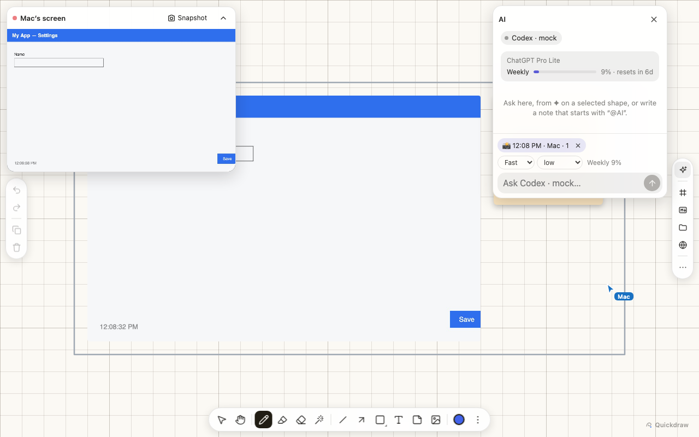
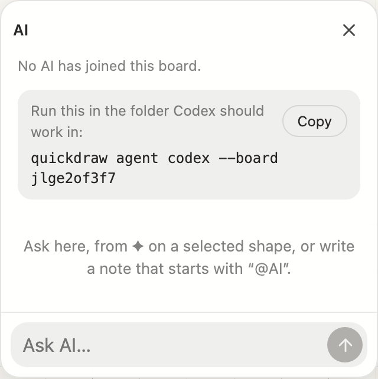
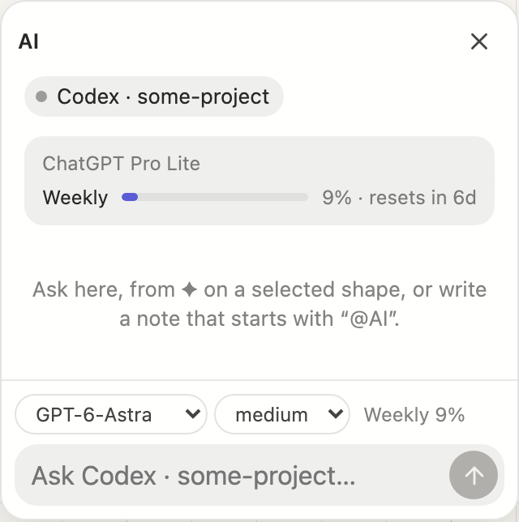
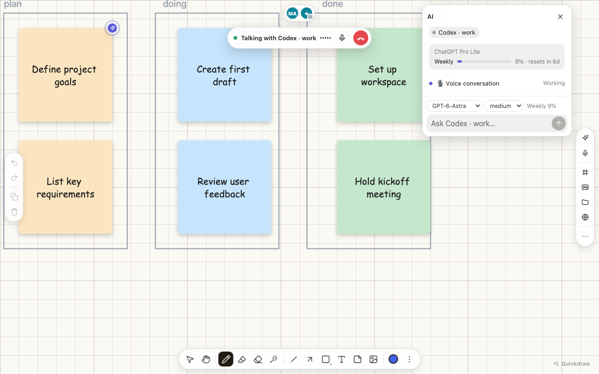

# quickdraw (app)

The app built from this repository's packages: one `quickdraw` command.

```sh
npm link -w apps/quickdraw        # puts `quickdraw` on your PATH (once)
quickdraw skill install           # teaches the agents on this machine the command (Claude Code, Codex, pi…)
quickdraw serve                   # http://127.0.0.1:8795/ lists the boards
quickdraw new "Sprint 12"         # a board; prints its id and URL
quickdraw note "Idea" --board ID  # edits it; `quickdraw help` lists the commands
```

## `quickdraw serve`

`quickdraw serve [--port 8795] [--host 127.0.0.1] [--data ~/.quickdraw]`

- **Boards**: `/` lists them as cards with a picture of each (drawn by a page that has the board open, a few seconds after it settles and when it is left; a board not opened since has none yet; ✦ marks one with an AI on it) and makes new ones — empty, from a JSON file (as a board's Export writes it), or as a copy — and renames and archives them (an archived board leaves the list, and can be brought back). `/b/<id>` is a board, with every package, driven by `quickdraw-toolbar`; its "…" menu has the list, renaming, versions, and importing into it or exporting it as JSON. A board saves itself as it changes. A board is only ever made on purpose: an unknown id is refused, never created.
- **Versions**: a board kept as it was, by hand ("Keep this version") or before each AI request and each restore (the last 20 of those). A version can be restored over the board — everyone on it sees the change — or opened as a board of its own.
- **The boards API** (JSON): `GET /api/boards[?archived=1]`; `POST /api/boards` `{ title, from?, file? }` (empty, a copy, or a JSON file's); `GET`/`PATCH /api/boards/<id>` `{ title?, archived? }`; `GET`/`POST /api/boards/<id>/versions` `{ name }`; `POST /api/boards/<id>/versions/<v>/restore` `{ as: 'board' | 'new' }`; `GET`/`PUT /api/boards/<id>/thumbnail` (a JPEG, PNG or WebP, 500 KB at most).
- **The packages it imports**, served from wherever Node resolves them (`/_/<package>/src/…`), so it runs from any directory. Only their `src` is served.
- **A relay per board** at `/ws/<id>` for sync across tabs and devices, with live cursors. The protocol is in [`src/protocol.js`](src/protocol.js), shared by the server, the page and the CLI.
- **Who is here** ([`quickdraw-presence`](../../packages/quickdraw-presence)): a row at the top of the board shows everyone on it, people and agents. Press yourself to set your name, colour and a status ("reviewing", "away"); they are kept in that browser. Press someone to follow them: their view if they are a person, where it works if it is an agent. Moving the view yourself stops following. Someone out of sight shows as an arrow at the edge, which takes you there. An agent's cursor says what it is doing just then — thinking, reading the board, searching the web, running a command, making an image, drawing, waiting for you, done — and moves to match: it mulls in a small circle, sweeps as it reads, bobs while it waits, hops when done. The server keeps each connection's latest presence in memory only, so a page that comes later sees everyone at once.
- **Agents on a board**, through the same relay: an agent joins with a name and what it knows, and the page's AI panel ([`quickdraw-agent`](../../packages/quickdraw-agent)) lists it and sends it requests. The server passes requests to the agent they are addressed to, and the agent's events (progress, messages, approvals, operations with their diffs) to every page; a person's replies and approvals go back to the agent. It keeps each request's thread, so a page that reloads — or another device — sees it as it was, including what was undone. An agent that leaves ends what it was doing with an error in the thread. It does not know or start what an agent runs on.
- **Screen sharing** ([`quickdraw-screenshare`](../../packages/quickdraw-screenshare)), for reviewing an app together: someone uses "…" → **Share screen** to share the tab or window they are working in. Everyone on the board watches it live in a window over the board. Anyone can press **Snapshot**, and that moment lands on the board, at full size, in a frame of its own ("12:08 · Mac") for everyone to write and draw on. The relay carries it (`SHARE` messages and `LIVE` frames, never stored): one sharer per board, and whoever starts sharing takes over. A page that falls behind skips frames. Sharing needs a secure page on a computer (`http://localhost`, or https through `tailscale serve`); anyone can watch, phones included.
- **Talking with an agent** ([`quickdraw-voice`](../../packages/quickdraw-voice)): the microphone on the right starts a conversation with an agent that talks (`quickdraw agent codex-app-server` does). The page makes a WebRTC offer and sends it with a request; the agent answers through the relay, and from then on the sound goes straight between the page and the voice model, never through the server. The offer and the answer go between that page and that agent only and are not stored. Closing the page hangs up. The conversation is a thread in the panel like any request: what was said, and what was done, to undo.
- **The laser pointer and the pen**: a laser is shared (quickdraw-presence sends its strokes as they are drawn, and the core draws everyone's), so people see each other's, and an agent's: `quickdraw point ID|X,Y [--circle]` and the tool `point_at` draw one with the cursor on its tip, hold it and fade it, leaving nothing. `quickdraw pen circle|underline ID` and `pen points …` (the tool `draw_on`, the step `pen`) mark the board with a hand-drawn stroke that stays; the layout linter lets pen marks sit on anything.
- **Who made what**: a shape carries who made it (`made`) and who changed it last (`edited`), each with when. A page marks what its person does, in the same undo step ([`quickdraw-presence`](../../packages/quickdraw-presence)'s `bindAuthorship`); an agent's operations mark theirs. `read` shows them ("[note, by Claude, edited by Ann]"), and a session's `changes` says who.
- **Names**: an agent is named **what it is · the repository it works in** (`Claude · my-repo`; the defaults of `agent claude|codex|codex-app-server|pi` and `join`), and the board shows who started it beside that ("Claude · my-repo (ann)", from the server: an agent cannot say it). A person is named after their tailnet name until they choose one, and two people with the same name show as "Mac" and "Mac 2".
- **Where things go**: what an agent adds without a place goes in free space near what the person who asked was looking at (their request's view), or, for an agent in a session with no request, by the people on the board; a command with no one to go by puts it right of everything. `tidy` (the tool `tidy_frames`) gathers frames that spread out close together in reading order, each with what is in it. For work that keeps growing, a **bento grid** ([`quickdraw-layouts`](../../packages/quickdraw-layouts); the rail's grid button, `quickdraw bento`, the tool `add_bento`) holds frames that pack themselves: a cell that gets crowded grows (by hand, `span`, or by itself when an agent puts something `in` it) and the cells after it move along.
- **Bringing your own agent**: everyone on a board can bring an agent that runs on their own account, on their own computer, in their own folder: `quickdraw agent codex --board https://HOST/b/ID` (or, for Claude Code and other agents with the skill, `quickdraw join --board https://HOST/b/ID --name NAME`). An agent is its owner's: only the person who started it may ask it, answer it or stop it; the panel shows whose each is ("Claude · Ann") and says so to the others. Its owner opens it from their panel — to everyone here, or to people they pick — and closes it again; `--allow-remote` opens it to everyone from the start. The server tells people apart by their tailnet login (`tailscale serve` adds it, and strips any that comes from outside), and the host by its own (`tailscale status`), however they come; a connection it cannot tell (Funnel, a tagged device) is nobody's. Guests need a checkout of this repository and `npm link -w apps/quickdraw`, and to reach the host's board through the same tailnet (an invite, or the host's device shared with them).
- **Agents asking agents**: a note an agent writes that starts with `@<agent>` (or `@AI`) asks that agent, as a person's does — from `quickdraw note`, a session, or Codex's and pi's tools. The writer tells the server (a `mention` message); the server makes the request if whoever started the writer may ask that agent: they started it too, or its owner opened it to them. The request says which agent asked (`from`), and so does its thread in the panel. An agent's note to itself, or a note already asking, is not asked again.
- **Tickets for agents** ([`quickdraw-tickets`](../../packages/quickdraw-tickets)): the rail's ticket button writes one — what to do on its first line, details below, and in its selection bar whom it is for (an agent here, or any). The kanban button adds Todo / Doing / Done columns; a ticket moves column with its status, and dragged into a column takes its status. Tickets are records on the board, so an agent picks them up whenever it comes: `quickdraw wait --take` waits for one, and people see its cursor go to the ticket as it takes it (see [Board commands](#board-commands)).
- **Feedback to an agent**: snapshots written on since they last went to an agent show as chips in the AI panel ("📸 12:08 · Mac · 3"). They go with the next request, and × leaves one out. The agent gets what people wrote, and each snapshot twice: drawn with the notes and pen marks over it (in a headless Chrome, as for `export --format png`), and the screen as it was. Codex also gets a `look_at` tool, to see any frame or shapes as a picture.
  

- **Persistence**: the boards and their Yjs updates in `<data>/boards.sqlite` (`node:sqlite`), merged per board as they pile up, and the agents' threads beside them (not in the board's document). A board comes back when no one else is online.
- **Link previews** at `/preview` for `quickdraw-embed`'s link cards, with SSRF guards (https on 443, public addresses on every redirect hop, timeouts, size caps).

It listens on 127.0.0.1. To reach it from other devices, put something in front, such as `tailscale serve --https=8795 http://127.0.0.1:8795`.

On a local network without Tailscale, `quickdraw serve --host 0.0.0.0 --trust-lan-ip` lets the devices on it in straight, and tells people apart by their device: a connection from a private address with no proxy in between is the person at that address, so the agents someone starts on their own computer are theirs (only they can ask them, until they open them to others), and they are called what that person's page calls itself. An address tells devices apart, not people: someone's phone is not their laptop, several people behind one address are one, and anyone on the network can use an address. So it is off unless asked for. Pages are plain http then, so the microphone and screen sharing (which need https or localhost) are not there.

## `quickdraw agent claude` and `quickdraw agent codex`

`quickdraw agent claude|codex [--board ID|URL] [--name NAME] [--allow-remote] [--idle MINUTES] [--global] [-- ARGS…]`, from the folder it should work in: Claude Code or Codex on the board in its own TUI, where you can talk with it too. It works the board as any agent with the [skill](../../skills/quickdraw/SKILL.md) does (`quickdraw join`, `wait`, `finish`…); this gets that ready first:

- **The skill**: each reads yours before the repository's (Claude Code: `~/.claude/skills`; Codex: `~/.agents/skills`). If yours is there, it is kept up to date; else the repository's is installed or updated, at the root of the git repository (`--global`: for you instead), to commit for everyone's agents.
- **`quickdraw` for its shell**: when it is not on the PATH, a shim in `.quickdraw/bin` for this checkout (`npm link -w apps/quickdraw` puts it on the PATH for good). Codex runs commands in a sandbox without network, and `quickdraw` reaches the board (a local socket, the board's server): a rule in the repository's `.codex/rules/quickdraw.rules` (`prefix_rule(pattern = ["quickdraw"], decision = "allow")`) lets it, and only it, out of the sandbox. Codex reads a project's rules once you trust the project; until then it asks to run `quickdraw` outside the sandbox.
- **The board**: it joins from this folder (`quickdraw join`), then starts `claude` or `codex` telling it to take the board's requests (Claude Code with `--allowedTools "Bash(quickdraw:*)"`); what follows `--` goes to it (`-- --model opus`). When it exits, it leaves the board. `.quickdraw/` gets a `.gitignore`: what is kept there is this computer's.

## `quickdraw agent codex-app-server`

Codex without its TUI: it lives in the board's AI panel, where people ask it, pick its model, effort and voice, answer its approvals and talk with it (the microphone). `quickdraw agent codex-app-server [--board ID|URL] [--server URL] [--name NAME] [--id ID] [--model M] [--effort E] [--allow-remote] [--voice NAME] [--voice-model M] [--no-voice]`, from the directory Codex should work in (it offers the panel the models Codex lists, so people choose the model and effort per request; `--model` and `--effort` set the defaults there instead of your Codex settings; the thread shows what it runs on):

```sh
cd ~/src/some-project
quickdraw agent codex-app-server --board ID     # "Codex · some-project" joins the board
```

### Which board it joins

No need to note the board's id down:

- **Copy it from the board.** While no AI has joined, the board's AI panel (✦ on the right) shows the command for that board, with a Copy button; with an AI already there, "…" → *Copy AI command* copies it. It names the board by its id on this machine's `quickdraw serve` (port 8795), and by its page URL elsewhere (another port, or through `tailscale serve`), which says the server too.

  

- **Or choose it at the terminal.** Without `--board`, with several boards on the server, it asks which one:

  ```console
  $ quickdraw agent codex
  Which board?
    1) Plan  (jlge2of3f7)
    2) Retro  (bfbblsruqg)
  Number (1-2): 2
  Next time: quickdraw agent codex --board bfbblsruqg
  ```

  Only at a terminal: piped or run by another agent, it fails and lists the boards, as the board commands do. With one board it joins that one, and it never makes a board.

Codex joins the board as a participant with a cursor, and the board's AI panel sends it requests. It works in that directory with its files, its `AGENTS.md` and skills, and your own Codex settings (model, sandbox, approvals): asking from the board never gets it more than that. When Codex asks for an approval, the panel shows it to the people on the board.

- It runs `codex app-server` (JSON-RPC over stdio). The board tools of [`quickdraw-agent`](../../packages/quickdraw-agent) go to Codex as client-defined tools (`dynamicTools`, part of app-server's **experimental** API), and run in this process, on its copy of the board: each operation goes to the panel with its diff, so a request can be undone at once, and no board command runs in Codex's sandbox.
- People watch it work: each operation is made on a copy of the board first (checked, all or nothing), then put on the board a piece at a time with its cursor on each; the panel's view follows it for a request asked there.
- **Drawing together**: for anything bigger than a note or two, Codex first claims a work area (`claim_area`): a dashed box with its name and what it is making, in free space by what the request is about (or where the request says). Everyone sees where it will draw; its inside lets the pointer through, so people draw in it too. Drag its label to move it, its corner to resize it. What Codex adds without a place goes in the area, which grows to take in what it puts beside it. It builds in steps people can follow (skeleton, contents, arrows, tidy), and each step's result tells it what people added, changed or removed in the area, or that they moved it: it keeps their work and builds with it. The area goes when the request is done.
- **Asking and answering on the board**: the panel's dashed-square button lets you drag out where it should work before you ask; that box is its work area from the start, and Codex is told where it is. While it works, an approval shows above its area's label too (Allow / Deny), and **Stop** by the label (or in the thread) ends its turn where it is (`turn/interrupt`): what it did stays, to keep or undo, and what it was waiting on is declined.
- **Images**: Codex's image generation works as usual; an `add_image` tool puts a generated image (or an image file from the working directory) on the board, where Codex says. Images are made lighter first (1024 px at most, a JPEG unless see-through), as every device loads them with the board. With `split`, a sheet laid out as an even grid — stickers for reacting on the board, icons, sprites — is cut into its cells, which go on the board as separate images in the same grid, in a frame if asked: "make 8 LINE-style reaction stickers and put them on the board one by one" works as one request. The shrinking and cutting is done by `sips` on macOS, else by Pillow through [`uv`](https://docs.astral.sh/uv/) ([`src/agent/image_tool.py`](src/agent/image_tool.py); uv fetches Pillow the first time); with neither, images go as they are and sheets cannot be cut. `QUICKDRAW_IMAGE_TOOL=sips|uv|none` chooses.
- **Who may ask it**: its owner, the person who started it: on the computer running `quickdraw serve`, or on their phone or another computer through `tailscale serve` (the same tailnet login), and whom they open it to from the panel; `--allow-remote` opens it to everyone on the board. The server tells people apart: a connection is the host's when it comes straight to this computer (from a loopback address, to a loopback name, with no proxy's headers, and — from a browser — from one of the server's own pages, so another site open in the same browser cannot pass for it), and a tailnet login's when `tailscale serve` brings it (it adds `Tailscale-User-Login`, and strips any that comes from outside); the host's own login comes from `tailscale status`. Anyone else sees the panel, the threads and the usage, but cannot send requests, replies or approvals to it; the panel says whose it is and why. The server checks, and the agent checks again (see [Bringing your own agent](#quickdraw-serve)).
- **Account and usage**: the panel shows what Codex runs on — the kind of account and its plan ("ChatGPT Pro Lite", "OpenAI API key"; never its email, as everyone on the board sees it) — and how much of each usage limit is used and when it starts again, from app-server's `account/read` and `account/rateLimits/read`, kept up to date by its `account/rateLimits/updated` notifications. The one most used is also beside the model picker.

  

- **Checking its work**: once it thinks a piece is done, Codex calls `check_board` (`quickdraw-agent`'s linter) on the frame or shapes it worked on, by default its work area, with `fix`: it fixes what needs no judgement itself, in one undoable step (labels too big for their shapes, shapes or frames on top of each other, things out of or against a frame's edge), and reports the rest, such as an arrow across a shape, for Codex to fix. Drawing first and fixing after is quicker than getting every position right first. `quickdraw lint [--fix]` does the same from the command line.
- One Codex thread per request; a follow-up in the panel continues it (and steers a turn that is still running).
- **Talking**: press the microphone on the board's right rail and say what you want, while it works. `codex app-server`'s realtime conversation (`thread/realtime/*`, **experimental**) runs it: a voice model (`--voice-model`, `gpt-live-1-codex` by default) talks with you and hands the work to a Codex thread of its own as you speak, and that thread uses the board tools like any request. The call is WebRTC, placed by app-server with your own Codex sign-in (a ChatGPT account works; no API key needed), so the sound goes straight between your browser and OpenAI. A bar over the board says who you talk with and what was last said, with mute and hang up; the panel's thread keeps what you said, what it answered, and what it did (to undo). Its voice is picked in the AI panel, beside the model and effort ("Voice: cove"), and remembered per agent on that device; the list is what app-server offers for the realtime v3 conversation (`thread/realtime/listVoices`' v1 set: `juniper`, `maple`, `spruce`, `ember`, `vale`, `breeze`, `arbor`, `sol`, `cove`), and `--voice` sets the one it uses unless a person picks another (one not on the list is left out, with a warning). `--no-voice` turns talking off. The same people may talk as may ask (`--allow-remote`); a microphone needs a secure page (`http://localhost`, or https through `tailscale serve`).

  
- Ctrl-C leaves the board; so does losing Codex or the board. What it was still doing ends with an error in the thread.

## `quickdraw agent pi`

`quickdraw agent pi [--board ID|URL] [--server URL] [--name NAME] [--id ID] [--model PROVIDER/ID] [--effort LEVEL] [--allow-remote] [--no-approval]`, from the directory [pi](https://github.com/earendil-works/pi) should work in:

```sh
npm i -w apps/quickdraw @earendil-works/pi-coding-agent   # pi's SDK, an optional dependency (once)
cd ~/src/some-project
quickdraw agent pi --board ID        # "pi · some-project" joins the board
```

pi joins the board as Codex does — the same panel, work areas, steps people watch, undo, Stop, feedback on snapshots, `look_at`, and who may ask it — but it runs in this process through pi's SDK, with pi's own settings and sign-ins (`~/.pi/agent`) and the directory's `AGENTS.md` and skills.

- **Models**: the panel offers every model pi can use (those it has a sign-in or key for), as `provider/id`, with the thinking levels a reasoning model takes. `--model` and `--effort` set the defaults there; otherwise pi's default model and thinking level, if set.
- **Approvals**: pi asks no one before it runs a command or changes a file. Here its `bash`, `edit` and `write` wait for a person's Allow in the panel (and by its area's label); Deny tells pi it was declined. `--no-approval` lets them run.
- One pi session per request, in memory (not in pi's session list); a follow-up continues it, steering a run that is still going.
- It does not talk (no microphone) or make images; `add_image` still puts image files from the working directory.

### Another agent

Codex ([`src/agent/codex.ts`](src/agent/codex.ts)) and pi ([`src/agent/pi.ts`](src/agent/pi.ts)) are two adapters over one `BoardAgent` ([`src/agent/board-agent.ts`](src/agent/board-agent.ts)), which knows the board and nothing of what runs on it. Another agent is a third: hand its model `agent.tools` (JSON Schema), run each tool call with `agent.runTool` (and `look_at` with `agent.picture`), ask with `agent.approve`, report with `agent.emit`, `agent.status` and `agent.activity`, and set `onRequest`, `onReply` and `onStop`; then add it to `bin/quickdraw.ts`.

## Board commands

`quickdraw boards | new | read | export | note | text | shape | markdown | embed | image | frame | arrow | update | move | arrange | fit | delete | apply | tickets | ticket | wait | take | done | fail | watch | join | next | say | finish | area | who | changes | leave | log | undo`. They join a board like a browser tab, as one more peer with a cursor, and print JSON.

- **Which board**: `--board` takes an id, the page URL (`https://host/b/<id>`, as the browser shows it) or the relay URL (`ws://host/ws/<id>`); or `$QUICKDRAW_BOARD`; or `--file` for a JSON file. Ids are looked up on `--server` / `$QUICKDRAW_SERVER`, by default this machine's `quickdraw serve`. Without a board, the server's only board is used; with several, the command fails and lists them — it never makes one up. (`quickdraw agent codex` at a terminal asks instead: [Which board it joins](#which-board-it-joins).) They are built on [`quickdraw-agent`](../../packages/quickdraw-agent)'s operations.

- **Images and embeds**: `image FILE` puts an image file from the working directory (made lighter, and cut into cells with `--split COLSxROWS`, as `add_image` does); `embed URL` a page or a link card, `embed --html-file` inline HTML. On a live board a link card gets its title and picture from the server's `/preview`, as in the page; Codex's `add_embed` too.
- **Joining a board** (`join`, `wait`, `say`, `finish`, `area`, `who`, `changes`, `leave`): for an agent that has only a shell and the [Skill](../../skills/quickdraw/SKILL.md) — Claude Code, or any other — to be on a board as Codex is. `join` starts a process that joins the board as an agent (in the AI panel, with a cursor) and stays after the command, as long as commands keep coming (30 idle minutes by default, `--idle`) or until `leave`. It writes `.quickdraw/session.json` in the directory; the commands run there afterwards are sent to it over a local socket ([`src/session`](src/session)) and run on its board, as that agent. It is a third runtime over `BoardAgent`: requests, people's replies, Stop and tickets for it wait in an inbox until `wait` takes one (`next` is the same); while it waits, its cursor stays by the people on the board (the biggest group of their cursors and views, else where it last worked), "ready for a request"; a request taken is the one it works on, so what it draws goes in that request's thread (put a piece at a time, undone as one, as Codex's). `who` says who is on the board and what they look at, `changes` what changed since it last looked (`wait` gives that with each request). Approvals are the agent's own; nothing is asked in the panel.
- **Tickets**: `tickets` lists them (`--mine`: for `--name` or any agent; `--status`); `wait` (not on the board; on it, `wait` is the session's) stays on the board until a ticket is to do for this agent and prints it (`--take` takes it too; `--timeout SECONDS`), while its cursor says it is waiting; `take`, `done` and `fail` (`--result`) move one on; `watch` prints each change to the tickets as a line of JSON until stopped. Two agents taking the same ticket at once: the peers settle on one, and the other's `take` fails (`wait --take` waits for the next). An agent's loop is `wait --take`, the work, `done`.
- **Undo**: each operation's diff goes to `.quickdraw/log.jsonl` in the working directory (or `$QUICKDRAW_LOG`); `undo` reverts what nobody changed since and reports the rest.
- **PNG** (`export --format png`): drawn by the core itself in a headless Chrome already on the machine — see below.

Agents learn the commands from the [Agent Skill](../../skills/quickdraw/SKILL.md). `quickdraw skill install` puts it where they look: `~/.agents/skills/quickdraw` (the Agent Skills location, read by Codex, pi and others) and `~/.claude/skills/quickdraw` (Claude Code; a link to the first). `--project` installs it in the current project's `.agents/skills` and `.claude/skills` instead, at the root of its git repository from any folder in it (agents look from where they start up to that root), ready to commit for everyone's agents; `--for agents` or `--for claude` for one kind only. It is a copy: install again after updating (`quickdraw skill status` says when one is behind), or `--link` links to this checkout, which it then follows (not for committing: it says so with `--project`). `quickdraw skill uninstall` removes it; neither touches another skill of the same name without `--force`.

### PNG export and the machine it runs on

- **Out of sight**: `--headless=new`, no window, focus, mouse or keyboard; on macOS it registers as a background-only app (not in the Dock or ⌘Tab).
- **Separate from the user's Chrome**: a throwaway profile (removed after), no extensions, sync, background networking or keychain.
- **No ports**: driven over a pipe (`--remote-debugging-pipe`); the page's code is served from disk through DevTools request interception, and every other request is refused.
- **Reused, without leaks**: one Chrome per `Renderer`; each render gets its own browser context and page, disposed afterwards; Chrome closes after 30 s idle and restarts every 100 renders. A command reuses it for every image it writes (e.g. `--frame all`) and closes it at the end.
- **Never outlives its process**: Chrome runs in its own process group, and a one-line shell watchdog ends it and removes its profile if the Node process dies without cleaning up (SIGKILL, SIGINT, SIGTERM). Stale profiles older than a day are swept on the next launch.
- **Smaller**: no GPU process, one renderer process, background features off.

## Moving from the old example server

A board from the old example server (`examples/quickdraw-yjs/board.sqlite`) carries over: copy the file to `~/.quickdraw/board.sqlite`. The next `quickdraw serve` takes it in as a board called "Board" and renames the file to `board.sqlite.imported`.

## Development

The Node side is TypeScript that Node runs as is (type stripping, Node ≥ 23.6): no build, and only erasable syntax (no `enum`, no parameter properties). Node does not strip types under `node_modules`, so the command runs from a checkout or `npm link`, not from a registry install. The page stays plain JavaScript that the browser loads as served.

```sh
npm test -w apps/quickdraw
npm run typecheck -w apps/quickdraw
```
